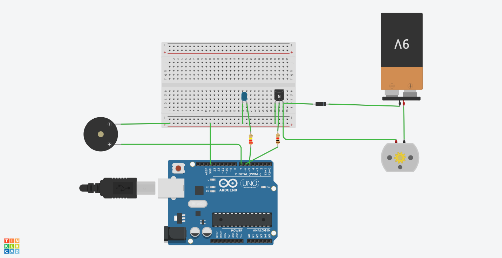

# 🔌 Serial Device Controller – Arduino Project

Control multiple devices like an **LED**, **fan**, and **buzzer** using simple commands from the Serial Monitor. This project helps you learn **serial communication**, **digital control**, and **command parsing** on Arduino.

---

## 🛠 Features

- 💡 Turn LED ON/OFF via `ledon` / `ledoff`
- 🌬️ Start/stop fan with `fanon` / `fanoff`
- 🔔 Control buzzer using `buzzeron` / `buzzeroff`
- 📟 Serial Monitor displays real-time feedback

---

## 🔩 Components Used

| Component          | Quantity |
|-------------------|----------|
| Arduino UNO        | 1        |
| LED + 220Ω Resistor| 1        |
| DC Fan             | 1        |
| Piezo Buzzer       | 1        |
| Jumper Wires       | As needed |
| Power Supply       | USB or Battery |

---

## 🧠 How to Use

1. Upload the code to Arduino using Arduino IDE  
2. Open **Serial Monitor** at `9600 baud`  
3. Type commands like these and press Enter:

ledon --> Turns on the LED
ledoff --> Turns off the LED
fanon --> Turns on the fan
fanoff --> Turns off the fan
buzzeron --> Turns on the buzzer
buzzeroff --> Turns off the buzzer

yaml
Copy
Edit

✅ Each command prints feedback in Serial Monitor.

---

## 🖼️ Circuit Diagram

> Make sure:
> - LED → Pin 8 with 220Ω resistor  
> - Fan → Pin 9 (via transistor if needed)  
> - Buzzer → Pin 10

---

## 💻 Arduino Code

📂 Click to view the full code file here:  
[`serial_device_control.ino`](images/Epic Lahdi.png)

---

## 📁 Project Files

| File Name                 | Description                |
|--------------------------|----------------------------|
| `serial_device_control.ino` | Main Arduino code        |
| `serial_device_circuit.png` | Circuit diagram image    |
| `README.md`               | Project documentation     |

---

## 🚀 Real-World Learning

- 🔌 Serial-based device control  
- 📟 Live command response via serial interface  
- 🔧 Smart interaction without extra screens  
- 💼 Great for resumes, demos, internships

---

## 👨‍💻 Author

**Parth Pawar**  
🔗 [GitHub](https://github.com/parth-558)  
🔗 [LinkedIn](https://www.linkedin.com/in/parth-pawar-b82628248/)

> 💬 "Building interactive systems that talk to you!"

---

## 🏷️ Tags

`arduino`, `serial`, `led`, `buzzer`, `fan`, `command-control`, `iot`, `embedded`, `serial-monitor`

---
